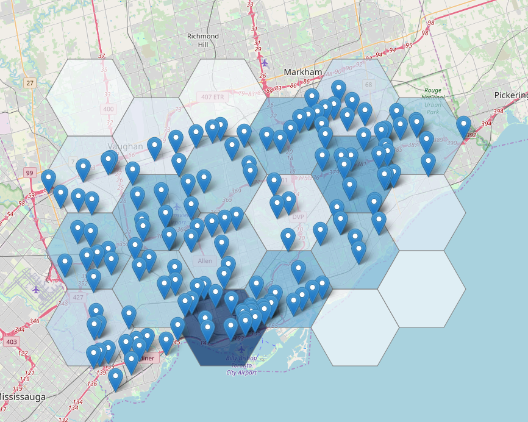

# example-leaflet-point-in-hexagon

An example of a heat map with points in hexagon using leaflet.



# Use

```
npm install
npm run start
```

## Dataset

The data used originates from:

* https://open.toronto.ca/dataset/red-light-cameras/
